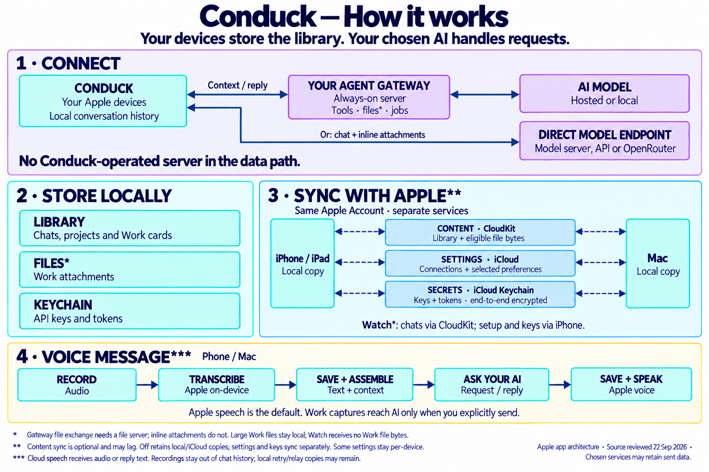

<p align="center">
  
</p>

<h1 align="center">Conduck</h1>

<p align="center"><strong>Your AI. Every Apple device. No Conduck middleman.</strong></p>

<p align="center">
  The native Apple client for the AI you choose — your own server, a local model, or OpenRouter.<br />
  One conversation across iPhone, iPad, Mac, Apple Watch, and CarPlay.
</p>

<p align="center">
  <a href="https://apps.apple.com/app/id6773045286">
    
  </a>
</p>

<p align="center">
  <a href="https://conduck.com/#film">Watch the 40-second film</a>
  ·
  <a href="https://conduck.com/setup/">Setup guide</a>
  ·
  <a href="https://conduck.com/discord/">Discord</a>
</p>

[](https://conduck.com/#film)

Conduck is the app, not the AI. There is no model inside it and no Conduck account to create: you connect the AI you already use, and your device talks to it directly under your own keys. The code is open source under Apache-2.0.

## Why Conduck

- **Ask from anywhere.** Action Button, Control Center, Shortcuts, the Mac menu bar or a global hotkey, your Watch, or CarPlay.
- **One conversation on every device.** Start on the Mac, continue on the iPhone, check the reply on your wrist — synced through your own private iCloud.
- **Talk, type, or share.** On-device dictation, photos and text files, the share sheet, and Screenshot & Ask on Mac.
- **Work, a desk for your projects.** Collect notes, screenshots, and files from any device, group them into projects, and hand a project to your AI only when you say so.
- **See what you use.** Turns, tokens, response times, and reliability per gateway, device, and model — measured on your device, visible only to you.
- **Nobody in the middle.** No Conduck server, no account, no analytics, ads, tracking, or telemetry.

<sub>Requires iOS, iPadOS, macOS, and watchOS 26.5 or later. The Mac app needs Apple silicon. CarPlay runs through the iPhone app.</sub>

## Get started

Free, and no account with us.

| You have… | In Conduck | You get |
|---|---|---|
| **No server yet** | Settings → Personal AI → **Sign in with OpenRouter** | Chat with images and text files, in about a minute |
| **Ollama or LM Studio on a Mac** | Add a **Custom endpoint** ([steps below](#ollama-on-the-same-wi-fi)) | Your local models on the same Wi-Fi |
| **An agent server** (OpenClaw, Hermes, or your own) | Scan a setup code from [`conduck-connect`](https://github.com/gigaduckai/conduck-connect) | Agent tools, memory, long-running jobs, and file exchange |

Anything that speaks the OpenAI chat API works too — vLLM, LiteLLM, Open WebUI, and more. A plain model endpoint gives you chat and inline attachments; agent tools and full file exchange need an agent server. Built your own AI? Hand the [adapter contract](https://conduck.com/setup/adapter/v1/) to the coding tool that built it, and `conduck-connect --check-adapter` verifies the result.

### Ollama on the same Wi-Fi

<details>
<summary>Four steps, no key needed</summary>

1. Let Ollama answer on your network (by default it listens on the Mac alone), then quit and reopen it. Newer builds also have a network toggle in settings.

   ```bash
   launchctl setenv OLLAMA_HOST "0.0.0.0:11434"
   ```

2. Find the Mac's address: System Settings → Wi-Fi → Details, or `ipconfig getifaddr en0` (looks like `192.168.1.20`).
3. In Conduck, open Settings → Personal AI, add a **Custom endpoint** at `http://192.168.1.20:11434`, test the connection, and pick a model.
4. Ask something.

Plain `http://` works only for a private address on your own network — that is Apple's rule. To reach your server from anywhere, including the car and the Watch away from home, put HTTPS in front of it; `conduck-connect` walks you through it. The certificate must be one your device already trusts (a root pushed by MDM counts): Apple lets apps make certificate checks stricter, never looser, so there is no "ignore certificate errors" switch. The [certificates guide](https://conduck.com/setup/tls/) covers Tailscale Serve, Let's Encrypt, and Caddy.

</details>

## Private by design

Your devices keep the library. Your chosen AI answers the requests. No Conduck-operated server sits anywhere in the path.

[](docs/images/conduck-architecture.png)

<details>
<summary>Read the diagram as text</summary>

- **Connect.** Conduck sends context from local conversation history directly to your chosen agent gateway or model endpoint. Each chat stays bound to its connection. An agent gateway can run tools and jobs; a plain model endpoint provides chat and inline attachments. Gateway file exchange uses a separately configured file server. No Conduck-operated server sits in these paths.
- **Store.** Chats, projects and Work materials live on your devices; API keys and tokens live in Keychain. Eligible Work files can sync, while large files stay on their original device. Your chosen gateways and providers may retain the information you send under their own policies.
- **Sync.** Content uses private CloudKit, selected settings use iCloud's key-value store, and credentials use end-to-end encrypted iCloud Keychain. These services synchronize independently and can take time. Turning content sync off keeps local and existing cloud copies; settings and key sync continue separately. Watch chats use CloudKit, while setup and keys come from the paired iPhone; Work file bytes do not sync to Watch.
- **Speak.** On iPhone, iPad and Mac, Conduck records, transcribes, saves the text, assembles context, asks your AI and saves the reply. Apple speech is the default. Optional cloud speech receives audio for transcription or reply text for read-aloud. Recordings stay out of chat history, though local retry and relay copies can remain. Work captures reach AI only through an explicit handoff.

Architecture illustration based on source reviewed 22 September 2026.

</details>

[See exactly how your data moves](https://conduck.com/trust/) · [Privacy policy](https://conduck.com/privacy/)

## Official app or build it yourself

| | Official app | Your own build |
|---|---|---|
| **Get it** | [App Store](https://apps.apple.com/app/id6773045286) | Build from this repository |
| **Terms** | Individuals, including professional use; [organizations need a separate agreement](https://conduck.com/terms/) | Apache-2.0, including commercial use |
| **Name and art** | Conduck | “Conduck Community” with placeholder art |
| **CarPlay** | Included | Not included (needs Apple's per-team entitlement) |

The official app is built from this same source, plus branding, signing, and the CarPlay entitlement — no functional code is withheld.

### Build from source

1. Clone this repository.
2. Open `Conduck/Conduck.xcodeproj` in Xcode 26.5 or later.
3. Build and run. Simulator builds need no configuration.

An unsigned simulator build can't save keys, so a gateway added there won't persist — see [QA mode](docs/qa/qa-mode.md) or [building for your own devices](CONTRIBUTING.md#building-from-source). If you redistribute a build, pick your own name and icons as [TRADEMARKS.md](TRADEMARKS.md) requires.

## Contributing

- Start with [CONTRIBUTING.md](CONTRIBUTING.md) — including the glossary, since *gateway* means something different here — then the [architecture document](docs/ai-context/spec.md) and the [project map](docs/ai-context/project-structure.md).
- Questions and setup help: [Discord](https://conduck.com/discord/). Bugs and feature requests: GitHub issues.
- Contributions use the Developer Certificate of Origin (`git commit -s`), no CLA.
- Report security issues privately via [SECURITY.md](SECURITY.md).

## License and trademarks

Conduck-authored code and neutral placeholder art are licensed under [Apache-2.0](LICENSE). Bundled third-party code remains under its own licenses; see [NOTICE](NOTICE) and [THIRD_PARTY_NOTICES.md](THIRD_PARTY_NOTICES.md).

The Conduck™ name and official duck-character artwork are excluded from that license. Their use is governed by [TRADEMARKS.md](TRADEMARKS.md).

Apple, the Apple logo, Apple Watch, App Store, CarPlay, iCloud, iPad, iPhone, Mac, macOS, watchOS, and Xcode are trademarks of Apple Inc., registered in the U.S. and other countries and regions.
